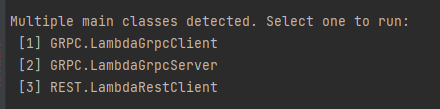
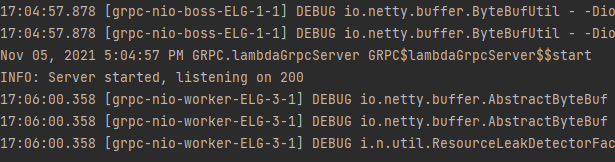
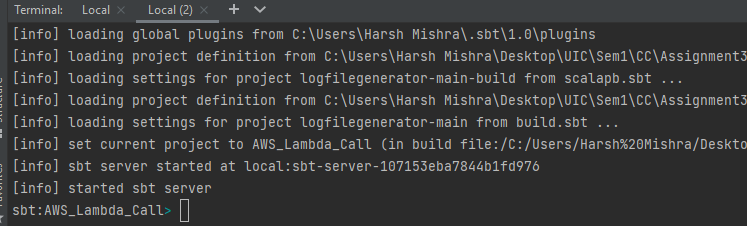
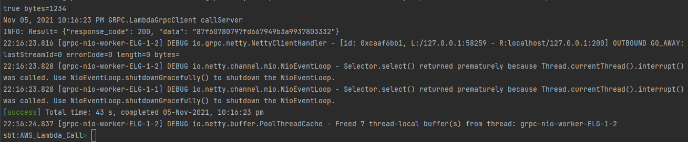
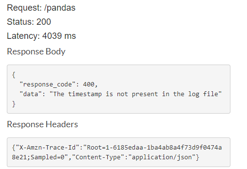

# Harsh Mishra - UIN 653554247

# Homework 3 (CS 441)

### Problem Statement: 
#### i) Create an AWS Lambda function to analyze a particular type of Log Data. 
#### ii) The AWS Lambda function needs to be then called via REST API calls as well as Google RPC. 
#### iii) The log file is generated by running the program on an EC2 instance and the logs are redirected direcetly to an S3 bucket that the user sepcifies.

### How to run the program:

#### Input Parameters that can be changed from the lambdaJson.conf file in resources:
```
{
"Bucket": "Name of S3 bucket",
"Key": "Log file name present in the above mentioned S3 bucket",
"Timestamp": "Time stamp to be searched for, for eg., 23:13:18.595",
"Interval": "The interval above & below the above mentioned timestamp, for eg..0:01:00.0",
"Pattern": "Pattern to be searched, for eg., ([a-c][e-g][0-3]|[A-Z][5-9][f-w]){5,15}"
}
```
#### The configuration file (lambdaJson.conf) also provides you the option to provide the link to your own API Gateway & the port number, on which you want the GRPC server to be hosted on.


```
sbt clean compile run
```
#### When asked for input, provide the Service which you want to use, REST or GRPC



#### If you want to run call the REST API, just type 1.

#### If you want to run GRPC, enter 2 & wait for the server to be created.

#### Once the server gets created, open a new terminal and type:
```
sbt
```



#### Once the sbt server starts, enter

``` 
runMain GRPC.LambdaGrpcClient
```

### Response from GRPC Server -:


### Response from the AWS API Gateway -:


#### Possible response codes:
##### 200 : Timestamp found in the logfile.
##### 400 : Timestamp not present in the logfile.

#### As seen in the above message, the status of the AWS request is different from the response_code that is returned by the AWS Lambda function.
#### I opted not to change the status of the Request as a whole and only return the response code based on the success/failure of event.
#### This helps us distinguish between cases when our AWS Lambda is not accessible to the ones when it is accessible but the desried output is not present.
#### The users can extract the returned response and have conditional checks on response_code based on their requirement.

### Future Enhancements:
#### "That may have been possible had I not spent hours figuring out the issue while importing Akka & running GRPC code from the IDE run module option!"
#### i) Use cached table whose keys are timestamps and values are the indexes of those timestamps in the log file. This would make the search even faster, as the table could act as an initial lookup.
#### ii) Separate out the current implementation into different Lambda functions, for eg. One reads user input and calls another lambda function which implements Binary search.


### Link to references:
### The repo which has additional code to sent the generated logfile to the specified AWS S3 bucket. [https://github.com/harshm16/logfiletoS3](https://github.com/harshm16/logfiletoS3)
### Creating an EC2 instance and SSHing to it. [https://youtu.be/Nv_1u8gCkIQ](https://youtu.be/Nv_1u8gCkIQ)
### To send files from EC2 to S3 bucket. [https://faun.pub/write-files-from-ec2-to-s3-in-aws-programmatically-716d1a4ef639]()
### Follow [this youtube video](https://youtu.be/7hKY9Qi3gQU) where I have explained the flow of the project.

### Some observations / recommendations:
#### i) Scala 3 doesn't support the use of Akka. When I tried importing Akka or any library which included http, from scala 3 or above, it coerced the version http_3 into the import string, thus leading to failure in importing.  
#### ii) Once the Proto file is compiled for the first time, the GRPC generates source files based on that Proto. When you try running the code through an IDE, it will throw an error, as those generated files are already created.


## Thank you
